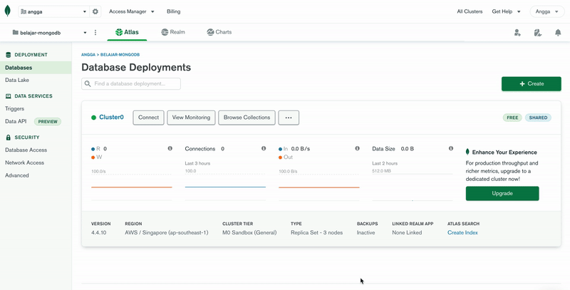

# Mongodb Basics

Dokumen ini berisi petunjuk dasar dan konsep mengenai MongoDB. Dokumen ini diperuntukkan untuk pengguna MongoDB tahap awal untuk menjadi lebih familiar terhadap database system MongoDB.

## Part 1 - Daftar Akun Gratis MongoDB Atlas
MongoDB Atlas merupakan Database as a Service (DBaaS) NoSQL yang bisa kita manfaatkan secara gratis dengan batasan penyimpanan sebesar 512 MB. 

Lakukan pendaftaran dengan menggunakan link berikut - https://www.mongodb.com/cloud/atlas/register. Kita dapat menggunakan email pribadi maupun company untuk melakukan pendaftaran. 

Selanjutnya kita akan diarahkan untuk membuat project pada akun yang baru kita buat.

## Part 2 - Setting Project & Cluster MongoDB

Membuat MongoDB Account:

Jika proses ini telah selesai, maka kita akan diarahkan kehalaman berikut

Setelah selesai membuat akun gratis MongoDB, selanjutnya kita dapat melakukan setting Project dan Cluster pada MongoDB, sesuai dengan langkah dibawah ini. 

Pada step ini kita akan diminta untuk menambahkan username dan password (dapat diubah, pada menu setting), dan menambahkan IP Address

## Part 3 - Load Sample Dataset

Untuk mengexplore fungsi dari MongoDB lebih lanjut, kita bisa melakukan load sample dataset yang telah disediakan. Sample dataset berukuran sekitar 350MB yang bisa kita download kedalam cluster yang telah kita buat.

Jika proses load sample dataset telah selesai, maka kita akan tampak daftar dataset seperti berikut:

## Part 4 - Connect Dataset to MongoDB Compass

Download Mongo Compass disini - https://www.mongodb.com/try/download/compass. Lalu install pada komputer kita.

Setelah kita mengunduh dan menginstall Mongo Compass selanjutnya kita akan menghubungkan sample dataset tadi dengan Mongo Compass agar lebih mudah bagi kita untuk melakukan query dan data explorasi. Instalasi Mongo Compass juga telah termasuk dengan MongoSH (Mongo Shell)

## Part 5 - Performing CRUD Operations

Untuk melakukan operasi CRUD (Create, Read, Update, Delete) kita dapat menggunakan Mongo Shell yang terinstall bersamaan dengan Mongo Compass. Berikut contoh command yang dapat digunakan [MongoDB Basic Commands](https://github.com/AnggaPradiktas/mongodb-basics/blob/main/basic-scripts.js)

